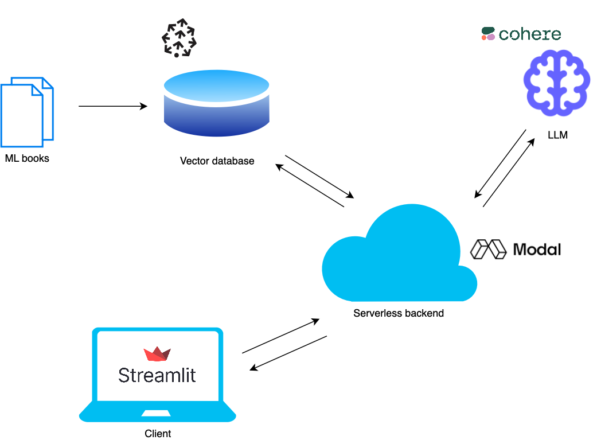

# ml-interview-warmup

## Overview

ML Interview Warmup is a retrieval augmented generation (RAG) based LLM web application that helps users practice machine learning interview questions.

The main components are:

- Modal serverless functions that handle request logic
- Pinecone vector database storing embeddings of ML books
- Cohere LLM API for question generation and scoring
- Frontend hosted on Streamlit for UI

## Usage

1. Go to https://ml-interview-warmup.streamlit.app
2. Select a topic to practice
3. Answer the question
4. Get feedback on your answer
